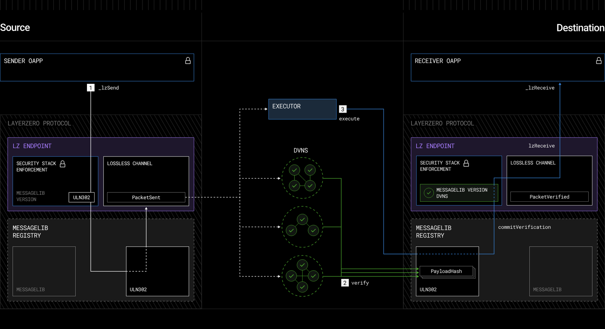

## LayerZero: 크로스체인 브릿지 작동원리 심층 분석

### 1. LayerZero는 무엇인가?

LayerZero는 **Omnichain Messaging Protocol**로, 서로 다른 블록체인 간에 **임의의 데이터를 안전하게 전송**할 수 있는 오픈소스 프로토콜입니다. TCP/IP가 인터넷의 "언어"라면, LayerZero는 Omnichain의 언어를 만들고자 합니다.

**핵심 특징:**

- **블록체인 독립적**: EVM 호환 체인, Solana, Aptos, Sui 등 다양한 블록체인을 지원
- **불변 프로토콜**: 핵심 컨트랙트는 업그레이드 불가능하여 보안 보장
- **모듈형 보안**: 각 애플리케이션이 자신만의 검증자 조합을 선택 가능
- **광범위한 네트워크**: 80개 이상의 블록체인 지원, 54,000개 이상의 스마트 컨트랙트 배포

2021년 Bryan Pellegrino, Ryan Zarick, Caleb Banister가 설립한 LayerZero Labs가 개발했으며, 2023년 Series B에서 $120 million을 모금하여 $3 billion의 평가를 받았습니다.

---
### 2. 서로 다른 체인 간 브릿지의 작동 원리

### 2.1 핵심 아키텍처 구성

LayerZero의 메시지 전달 시스템은 다음과 같은 **네 가지 주요 컴포넌트**로 구성됩니다:

| 구성 요소 | 역할 |
| --- | --- |
| **Endpoint (불변 스마트 컨트랙트)** | 각 체인의 진입점/출구점, 메시지 검증 및 전달 관리 |
| **MessageLib (메시지 라이브러리)** | 메시지 패킷 생성, 인코딩/디코딩, 검증 로직 구현 |
| **DVN (Decentralized Verifier Networks)** | 패킷의 payload hash 검증, 메시지 무결성 확인 |
| **Executor** | 검증된 메시지를 목적지 체인에서 실행, 가스 관리 |



### 2.2 Ultra Light Node (ULN) 구조

LayerZero의 혁신은 **Ultra Light Node**를 통한 경량 검증입니다:

- **기존 라이트 노드 vs. ULN**: 전체 노드 데이터 저장 없이 필요한 최소한의 정보만 검증
- **효율성**: 이더리움 같은 고비용 체인에서도 경제적으로 작동
- **검증 아웃소싱**: 오프체인 엔티티(릴레이어, 오라클)에 의존하여 무거운 계산 수행

### 2.3 메시지 흐름 (Step-by-Step)

**Source Chain (출발지 체인):**

1. **애플리케이션이 메시지 생성**: OApp(Omnichain Application) 컨트랙트가 `_lzSend()` 호출
    
    ```
    _lzSend(
        _dstEid,           // 목적지 체인 ID
        _message,          // 전송할 데이터
        _options,          // 실행 옵션
        MessagingFee(msg.value, 0),
        payable(msg.sender)
    )
    
    ```
    
2. **Endpoint가 패킷 생성**: MessageLib을 사용하여 메시지를 표준 패킷으로 변환
    - **패킷 구조**:
        - Header: 버전, Nonce, Source Endpoint ID, Destination Endpoint ID, Sender, Receiver
        - Body: Payload, GUID (Global Unique ID)
3. **이벤트 발생**: 패킷이 이벤트로 발생되어 오프체인이 감지
---
**Verification Phase (검증 단계):**

- 오라클(Oracle)이 제공하는 정보

Source Chain 블록의 헤더: 오라클은 Source Chain에서 트랜잭션이 실제로 발생했다는 사실을 Destination Chain으로 전달합니다.

체인 상태 정보: 오라클은 블록 헤더, 트랜잭션 포함 여부 등 외부 데이터를 블록체인에 안전하게 제공합니다.​

- 릴레이어(Relayor)가 제공하는 정보

트랜잭션 증명(Merkle Proof): 릴레이어는 Source Chain에서 해당 트랜잭션이 실제로 포함되었는지 머클 트리의 증명을 Destination Chain에 보냅니다.​

메시지 데이터: 사용자가 보낸 "전송 요청"의 실제 메시지와 관련된 데이터를 Destination Chain으로 전달합니다.

- 전체 흐름 예시

1. Source Chain에서 트랜잭션 발생

2. 오라클은 블록 헤더(블록의 상태)를 Destination Chain으로 전달

3. 릴레이어는 사용자 트랜잭션이 실제로 블록에 포함됐음을 증명하는 머클 프로프와 메시지 데이터를 Destination Chain으로 전달

4. Destination Chain에서는 오라클과 릴레이어가 제공한 정보가 일치하는지 검증한 뒤, 필요한 메시지 실행(예: 토큰 발행 등)을 진행    

---

1. **Oracle이 블록 헤더 수집**: Chainlink나 Band Protocol 같은 분산 오라클이 source chain의 블록 헤더 획득
2. **Relayer가 트랜잭션 증명 수집**: 독립적인 Relayer가 거래 증명(transaction proof) 생성
    - **핵심 설계**: Oracle과 Relayer는 **반드시 독립적**이어야 함
    - 이 독립성이 **신뢰 최소화(Trustlessness)** 달성
3. **DVN이 Payload Hash 검증**: 정의된 DVN들이 payload hash를 독립적으로 검증
    
    ```solidity
    // UlnConfig 예제
    struct UlnConfig {
        uint64 confirmations;              // 필요한 블록 확인 수
        uint8 requiredDVNCount;            // 필수 DVN 개수
        uint8 optionalDVNCount;            // 선택 DVN 개수
        uint8 optionalDVNThreshold;        // 임계값
        address[] requiredDVNs;            // 필수 DVN 주소
        address[] optionalDVNs;            // 선택 DVN 주소
    }
    
    ```
    
4. **Destination Endpoint가 검증 확인**: Destination chain의 MessageLib이 header와 proof 대조
    
    ```solidity
    function commitVerification(
        bytes calldata _packetHeader,
        bytes32 _payloadHash
    ) external {
        // 패킷 헤더 유효성 검사
        _assertHeader(_packetHeader, localEid);
    
        // receiver와 srcEid 추출
        address receiver = _packetHeader.receiverB20();
        uint32 srcEid = _packetHeader.srcEid();
    
        // 검증 및 저장소 정리
        _verifyAndReclaimStorage(config, keccak256(_packetHeader), _payloadHash);
    
        // endpoint에 검증 완료 보고
        ILayerZeroEndpointV2(endpoint).verify(origin, receiver, _payloadHash);
    }
    
    ```


**Execution Phase (실행 단계):**

1. **Executor가 메시지 전달**: Destination chain에서 `lzReceive()` 호출
    
    ```solidity
    function lzReceive(
        Origin calldata _origin,     // 출발지 정보 (srcEid, sender, nonce)
        bytes32 _guid,               // 메시지 고유 ID
        bytes calldata _message,     // 페이로드
        address _executor,           // 실행자 주소
        bytes calldata _extraData     // 추가 데이터
    ) public payable virtual {
        // Endpoint 검증
        if (address(endpoint) != msg.sender)
            revert OnlyEndpoint(msg.sender);
    
        // 메시지 디코딩 및 비즈니스 로직 실행
        (string memory decodedString) = abi.decode(_message, (string));
        lastMessage = decodedString;
    }
    
    ```
    

- 예시 : https://layerzeroscan.com/tx/0x7706d474fbd0fccef3c92935b8254a06986edd88d5f95c4fea528291e6eb59ba
- https://bscscan.com/tx/0x7706d474fbd0fccef3c92935b8254a06986edd88d5f95c4fea528291e6eb59ba
  
 **애플리케이션 로직 실행**: OApp이 메시지 수신 후 상태 변경 수행

### 2.4 신뢰 최소화 메커니즘

LayerZero의 보안 핵심은 **Oracle과 Relayer의 독립성**입니다:

```
시나리오 1: 정상 작동 (메시지 전달)
├─ Oracle: 올바른 블록 헤더 제공
└─ Relayer: 올바른 거래 증명 제공
    → 두 정보가 일치 → 메시지 전달 ✓

시나리오 2: 공격 시도 (메시지 위조)
├─ Relayer가 가짜 증명 생성
│   → 하지만 Oracle의 실제 블록 헤더와 불일치
│   → 메시지 거부 ✓
└─ 두 엔티티가 모두 일치하려면 반드시 협력해야 함
    → 독립성으로 인해 협력 불가능

```

이 설계로 인해 **단 하나의 참여자 손상만으로는 시스템을 무너뜨릴 수 없습니다**.

---

### 3. 가스 비용 및 비용 계산

### 3.1 비용 구성

LayerZero 메시지 전송 시 청구되는 비용은:

1. **Source Chain Gas**: 출발지 체인에서 트랜잭션 실행 비용
2. **DVN Fees**: 메시지 검증을 위한 분산 검증자 네트워크 비용
3. **Destination Chain Gas**: 목적지 체인에서 `lzReceive()` 실행 비용
4. **Executor Fee**: 메시지 전달 및 실행 서비스 비용

### 3.2 비용 추정 함수

개발자는 메시지 전송 전 `_quote()` 함수로 동적 가격 책정을 확인해야 합니다:

```solidity
function estimateFee(
    uint32 _dstEid,
    string memory _message,
    bytes calldata _options
) public view returns (uint256 nativeFee, uint256 lzTokenFee) {
    bytes memory _payload = abi.encode(_message);
    MessagingFee memory fee = _quote(_dstEid, _payload, _options, false);
    return (fee.nativeFee, fee.lzTokenFee);
}

// 내부 구현
function _quote(
    uint32 _dstEid,
    bytes memory _message,
    bytes memory _options,
    bool _payInLzToken
) internal view virtual returns (MessagingFee memory fee) {
    return endpoint.quote(
        MessagingParams(_dstEid, _getPeerOrRevert(_dstEid), _message, _options, _payInLzToken),
        address(this)
    );
}

```

### 3.3 Message Options를 통한 가스 최적화

각 메시지 유형에 따른 실행 옵션:

| 옵션 | 설명 | 용도 |
| --- | --- | --- |
| **lzReceiveOption** | `(uint128 _gas, uint128 _value)` | lzReceive 호출 시 사용할 가스 및 native value |
| **lzComposeOption** | `(uint16 _index, uint128 _gas, uint128 _value)` | 합성 메시지 실행 옵션 |
| **lzNativeDropOption** | `(uint128 _amount, bytes32 _receiver)` | 목적지 주소로 native token 드롭 |
| **OrderedExecutionOption** | - | 메시지 nonce 순서 강제 |

---

### 4. GitHub 코드 구현 분석

### 4.1 GitHub 레포지토리 구조

[LayerZero-Labs/LayerZero-v2](https://github.com/LayerZero-Labs/LayerZero-v2):

```
LayerZero-v2/
├── /protocol                    # 핵심 불변 Endpoint 컨트랙트
│   └── ILayerZeroEndpointV2.sol # V2 Endpoint 인터페이스
├── /messagelib                  # 메시지 라이브러리 및 ULN 구현
│   ├── SendLib (메시지 송신)
│   ├── ReceiveLib (메시지 수신)
│   └── ULN Configuration
├── /oapp                        # Omnichain Application 표준
│   ├── OApp.sol                # 기본 OApp 구현
│   ├── OAppSender.sol          # 송신 로직
│   ├── OAppReceiver.sol        # 수신 로직
│   ├── OFT.sol                 # Omnichain Fungible Token
│   └── ONFT.sol                # Omnichain NFT
└── /executors                  # Executor 구현

```

### 4.2 OApp 컨트랙트 구현 예제

**기본 구조:**

```solidity
// SPDX-License-Identifier: MIT
pragma solidity ^0.8.22;

import { Ownable } from "@openzeppelin/contracts/access/Ownable.sol";
import { OApp, MessagingFee, Origin } from "@layerzerolabs/oapp-evm/contracts/oapp/OApp.sol";
import { MessagingReceipt } from "@layerzerolabs/oapp-evm/contracts/oapp/OAppSender.sol";

contract MyOApp is OApp {
    string public data = "Nothing received yet.";

    // Constructor
    constructor(address _endpoint, address _delegate)
        OApp(_endpoint, _delegate)
        Ownable(_delegate)
    {}

    // 1. 메시지 송신
    function sendMessage(
        uint32 _dstEid,
        string memory _message,
        bytes calldata _options
    ) external payable {
        // 메시지를 bytes로 인코딩
        bytes memory _payload = abi.encode(_message);

        // 가스 비용 계산
        MessagingFee memory fee = _quote(_dstEid, _payload, _options, false);

        // 실제 전송 (msg.value >= fee.nativeFee 필요)
        _lzSend(
            _dstEid,
            _payload,
            _options,
            fee,
            payable(msg.sender)
        );
    }

    // 2. 메시지 수신
    function _lzReceive(
        Origin calldata _origin,
        bytes32 _guid,
        bytes calldata _message,
        address _executor,
        bytes calldata _extraData
    ) internal override {
        // 페이로드 디코딩
        string memory decodedString = abi.decode(_message, (string));

        // 상태 업데이트
        data = decodedString;

        // 이벤트 발생
        emit MessageReceived(_origin.srcEid, decodedString);
    }

    // 3. 비용 추정 함수
    function quote(
        uint32 _dstEid,
        bytes memory _payload,
        bytes memory _options,
        bool _payInLzToken
    ) public view returns (MessagingFee memory fee) {
        return _quote(_dstEid, _payload, _options, _payInLzToken);
    }
}

```

### 4.3 Endpoint 인터페이스 (ILayerZeroEndpointV2)

**핵심 메서드:**

```solidity
interface ILayerZeroEndpointV2 {
    // 메시지 송신
    function send(
        MessagingParams calldata _params,
        address _refundAddress
    ) external payable returns (MessagingReceipt memory);

    // 비용 추정
    function quote(
        MessagingParams calldata _params,
        address _sender
    ) external view returns (MessagingFee memory);

    // 설정 관리
    function setConfig(
        address _oapp,
        address _lib,
        SetConfigParam[] calldata _params
    ) external;

    function getConfig(
        address _oapp,
        address _lib,
        uint32 _eid,
        uint32 _configType
    ) external view returns (bytes memory);

    // 메시지 검증
    function verify(
        Origin calldata _origin,
        address _receiver,
        bytes32 _payloadHash
    ) external;

    // 메시지 수신 및 실행
    function lzReceive(
        Origin calldata _origin,
        address _receiver,
        bytes32 _guid,
        bytes calldata _message,
        bytes calldata _extraData
    ) external payable;
}

```

### 4.4 ULN 검증 설정 스크립트

**Receive Config 설정 예제:**

```solidity
pragma solidity ^0.8.22;

import "forge-std/Script.sol";
import { ILayerZeroEndpointV2, SetConfigParam }
    from "@layerzerolabs/lz-evm-protocol-v2/contracts/interfaces/ILayerZeroEndpointV2.sol";
import { UlnConfig }
    from "@layerzerolabs/lz-evm-messagelib-v2/contracts/uln/UlnBase.sol";

contract SetReceiveConfig is Script {
    uint32 constant RECEIVE_CONFIG_TYPE = 2;

    function run() external {
        address endpoint = vm.envAddress("ENDPOINT_ADDRESS");           // Chain B
        address oapp = vm.envAddress("OAPP_ADDRESS");                   // Chain B
        uint32 eid = uint32(vm.envUint("REMOTE_EID"));                 // Chain A ID
        address receiveLib = vm.envAddress("RECEIVE_LIB_ADDRESS");     // ReceiveLib

        // ULN 설정: Chain A → Chain B 메시지 검증
        UlnConfig memory uln = UlnConfig({
            confirmations: 15,                          // 15개 블록 확인 필요
            requiredDVNCount: 1,                        // 최소 1개 필수 DVN
            optionalDVNCount: 0,                        // 선택 DVN 없음
            optionalDVNThreshold: 0,                    // 임계값 없음
            requiredDVNs: new address[](1),            // 필수 DVN 배열
            optionalDVNs: new address[](0)             // 선택 DVN 배열 (비어있음)
        });

        // DVN 주소 설정
        uln.requiredDVNs[0] = vm.envAddress("REQUIRED_DVN_ADDRESS");

        // ULN Config를 bytes로 인코딩
        bytes memory encodedUln = abi.encode(uln);

        // SetConfigParam 구성
        SetConfigParam[] memory params = new SetConfigParam[](1);
        params[0] = SetConfigParam(eid, RECEIVE_CONFIG_TYPE, encodedUln);

        // Receive Library에 설정 적용
        vm.startBroadcast(vm.envAddress("SIGNER"));
        ILayerZeroEndpointV2(endpoint).setConfig(oapp, receiveLib, params);
        vm.stopBroadcast();
    }
}

```

### 4.5 패킷 헤더 검증 (ReceiveUln302)

**실제 검증 로직:**

```solidity
// LayerZero/V2/messagelib/contracts/uln/uln302/ReceiveUln302.sol

function _assertHeader(
    bytes calldata _packetHeader,
    uint32 _localEid
) internal pure {
    // 패킷 헤더 크기 검증: 81 바이트 고정
    if (_packetHeader.length != 81)
        revert LZ_ULN_InvalidPacketHeader();

    // 패킷 버전 검증
    if (_packetHeader.version() != PacketV1Codec.PACKET_VERSION)
        revert LZ_ULN_InvalidPacketVersion();

    // 목적지 Endpoint ID 검증
    if (_packetHeader.dstEid() != _localEid)
        revert LZ_ULN_InvalidEid();
}

// 패킷 구조 분석
struct PacketV1 {
    uint8 version;              // 1 byte
    uint64 nonce;               // 8 bytes
    uint32 srcEid;              // 4 bytes
    address sender;             // 20 bytes
    uint32 dstEid;              // 4 bytes
    address receiver;           // 20 bytes
    bytes32 guid;               // 32 bytes
    bytes payload;              // variable
}

```

### 4.6 OFT (Omnichain Fungible Token) 구현

- 전통적 락업/민트(랩핑) 모델과 달리, **mint-and-burn** 방식 OFT 구현​

- 소스체인에서 토큰 소각 → 목적체인에서 동량 발행(전체 공급 불변)

- 다양한 기존 토큰도 OFT Adapter로 확장 가능

**토큰 전송 예제:**

```solidity
// OFT 표준을 사용한 크로스체인 토큰 전송

pragma solidity ^0.8.22;

import { OFT } from "@layerzerolabs/lz-evm-oapp-v2/contracts/oft/OFT.sol";

contract MyOFT is OFT {
    constructor(
        string memory _name,
        string memory _symbol,
        address _lzEndpoint,
        address _owner
    ) OFT(_name, _symbol, _lzEndpoint, _owner) {
        // Wrapped 토큰 생성 (새로운 canonical 토큰)
    }
}

// 또는 기존 토큰을 브릿지하려면:

import { OFTAdapter } from "@layerzerolabs/lz-evm-oapp-v2/contracts/oft/OFTAdapter.sol";

contract MyOFTAdapter is OFTAdapter {
    constructor(
        address _token,
        address _lzEndpoint,
        address _owner
    ) OFTAdapter(_token, _lzEndpoint, _owner) {
        // 기존 ERC20 토큰을 omnichain으로 래핑
    }
}

```

---

### 5. 보안 및 신뢰 가정

### 5.1 LayerZero의 보안 원칙

1. **불변 Endpoint**: 핵심 프로토콜은 업그레이드 불가능, 영구 보안 보장
2. **모듈형 보안**: 각 애플리케이션이 자신의 DVN/Executor 조합 선택 가능
3. **독립성 요구사항**: Oracle과 Relayer는 절대 협력할 수 없어야 함

### 5.2 알려진 공격 벡터 및 방어

| 공격 유형 | 설명 | 방어 메커니즘 |
| --- | --- | --- |
| **Oracle 손상** | 잘못된 블록 헤더 제공 | Relayer의 독립적 증명으로 검증 |
| **Relayer 손상** | 가짜 거래 증명 제공 | Oracle의 블록 헤더와 대조 |
| **양쪽 협력 공격** | Oracle과 Relayer 모두 손상 | 독립성 보장으로 협력 불가능 |
| **Payload 조작** | 메시지 내용 변조 | Payload hash 검증 |
| **Nonce 공격** | 메시지 순서 조작 | 정렬된 Nonce 추적 |


---

### 6. 추천 학습 자료

**개발 문서:**

- [LayerZero V2 공식 문서](https://docs.layerzero.network/)
- [GitHub: LayerZero-v2](https://github.com/LayerZero-Labs/LayerZero-v2)
